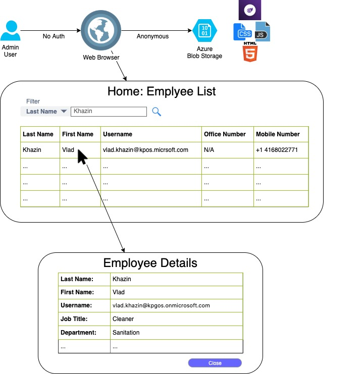

# Employee Service User-Interface

## Requirements



* DotNet Core WebAssembly UI
* No fancy graphical design is required
* Responsive design: rendered properly on desktop and mobile browsers
* Hosted on [Azure Storage](https://docs.microsoft.com/en-us/azure/storage/blobs/storage-blob-static-website)
* End-point specification: https://app.swaggerhub.com/apis/vkhazin/employee-svc/1.0.0
* End-point deployment: https://kpgos-poc-employee-svc.azurewebsites.net/
* Use mocks until end-point is ready for integration
* Filter options: 'Last Name' and 'First Name'
* Selecting a row will open employee details
* User details to be displayed as an overlay on top of the grid

## Acceptance Criteria

* Nothing is hard-coded, use configuration file instead
* A walk through a working deployment to Azure Storage, not a local machine
* Markdown documentation to explain the deployment/configuration steps

### Development 
* Install [.Net Core 3.1.](https://dotnet.microsoft.com/download)
* Clone the repository and navigate into the new directory using a terminal
 ```
> cd src/Client
> dotnet restore
> dotnet run
```

## Azure Setup

* Log into [Azure Portal](https://portal.azure.com) 
* Proceed to [storage accounts](https://portal.azure.com/#blade/HubsExtension/BrowseResource/resourceType/Microsoft.Storage%2FStorageAccounts)
* Create a storage account, will take a few moments to complete, navigate to overview when done
* Search for `static website` and enable static hosting
* For `Index document name` type `index.html` and save the changes
* There is also a [video walk-through](https://www.youtube.com/watch?feature=player_embedded&v=SnZ759xn9oM) available

and follow along below video to create a Storage Container > Static Website > $web Container

## Deployment to Azure

* Publish files to folder

```
> dotnet publish -c Release -o publish
```
Key auth (key can get on azure portal => storage account => access keys)
```
> az storage blob upload-batch -d '$web' --account-name <accountName> -s ./publish/wwwroot --account-key <key> --auth-mode key
```
Or 
```
> az login
> az storage blob upload-batch -d '$web' --account-name <accountName> -s ./publish/wwwroot
```
